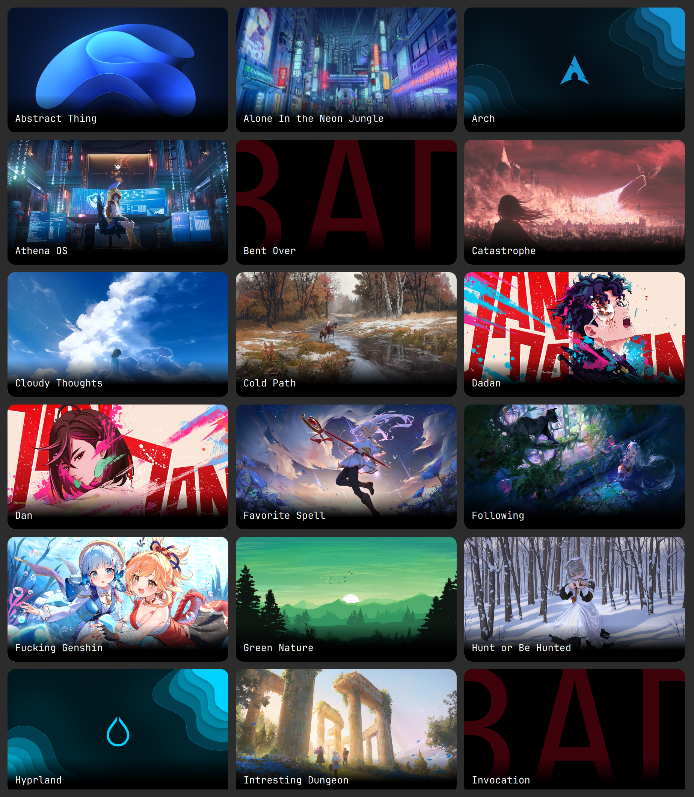

    
    <h1>BlaadPapers</h1>

> [!NOTE]
> The application is temporarily using hyprpaper IPC as the back-end

## Description
Convenient wallpaper manager supporting both GUI and CLI usage.
I will try to make it as fast and pleasing to the eye as possible.

Keep in mind that the application is being developed and tested on and for linux systems.
I will try to keep it running on other platforms as well, but this is not a priority.

    

## Installation

    
Arch Linux

    <pre><code class="language-bash">yay -S blaadpapers</code></pre>

    
Windows

    
Expected after adding major features and implementing own wallpaper rendering.

